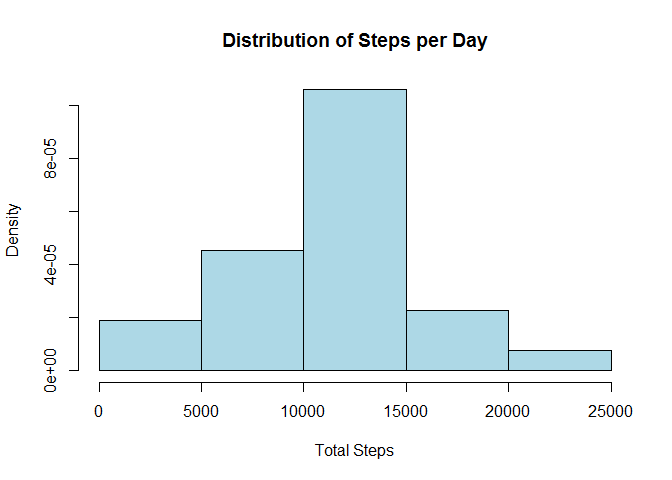
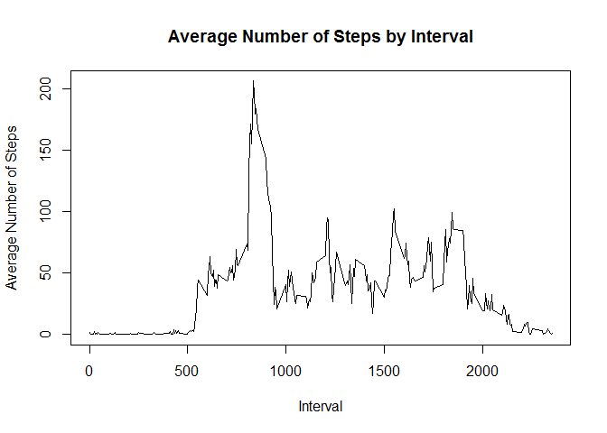
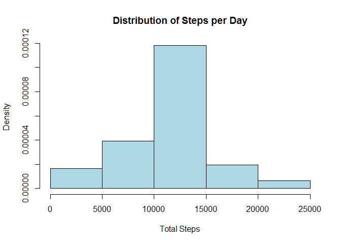
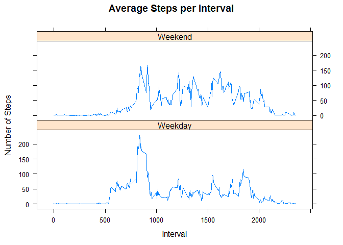

# Reproducible Research: Peer Assessment 1


## Loading and preprocessing the data

First we read the data with *read.csv* and then we transform the date column from a factor variable to a date variable.  


```r
activity_data <- read.csv("activity.csv")
activity_data$date <- as.Date(activity_data$date, format = "%Y-%m-%d")
```

## What is mean total number of steps taken per day?

First we find total steps per day while removing NA values. 


```r
library(sqldf)
steps_per_day1 <- sqldf("select date, sum(steps) as total_steps from activity_data where steps != 'NA' group by date order by date")
```

### Histogram of Total Steps per Day


```r
hist(steps_per_day1$total_steps, freq=FALSE, xlab="Total Steps", main= "Distribution of Steps per Day",col="lightblue")
```

 

### Mean and Median Total Steps per Day


```r
mean_daily_steps1 <- mean(steps_per_day1$total_steps) 
median_daily_steps1 <- median(steps_per_day1$total_steps)
```

The mean number of steps taken was 1.0766189\times 10^{4}.  

The median number of steps taken was 10765.

## What is the average daily activity pattern?

We will use the package *sqldf* to find the average number of steps by interval.  


```r
library(sqldf)
steps_by_interval <- sqldf("select interval, avg(steps) as avg_steps from activity_data where steps is not 'NA' group by interval order by interval")
```

### Time Series of Average Number of Steps Taken Across All Days 


```r
plot(steps_by_interval$interval, steps_by_interval$avg_steps, type='n',main="Average Number of Steps by Interval",xlab="Interval",ylab="Average Number of Steps")
lines(steps_by_interval$interval, steps_by_interval$avg_steps, type='l')
```

 

### Maximum Number of Average Steps


```r
n <- which.max(steps_by_interval$avg_steps)
max.steps <- steps_by_interval$avg_steps[n]
interval.with.max <- steps_by_interval$interval[n]
```

The maximum number of average steps was 206.1698113.  This occurred in interval 835.


## Imputing missing values

### Number of NAs


```r
na.count <- sum(is.na(activity_data$steps))
```

There were 2304 NA values in the input dataset.  

### Strategy to Fill NAs

Each NA will be set to the mean for that 5 minute interval.


```r
library(plyr)
impute.mean <- function(x) replace(x, is.na(x),mean(x,na.rm=TRUE))
activity_data2 <- ddply(activity_data, ~interval, transform, steps=impute.mean(steps))
attach(activity_data2)
activity_data2 <- activity_data2[order(date, interval),]
detach(activity_data2)
```

The method of filling NAs with the mean for the time is based on a method Hadley Wickham explained on [Stack Overflow](http://stackoverflow.com/questions/9322773/how-to-replace-na-with-mean-by-subset-in-r-impute-with-plyr). If an interval has an NA, the NA will be replaced with the mean for that interval.  

### Steps per Day Summary

```r
library(sqldf)
steps_per_day <- sqldf("select date, sum(steps) as total_steps from activity_data2 group by date order by date")
mean_daily_steps <- mean(steps_per_day$total_steps) 
median_daily_steps <- median(steps_per_day$total_steps)
```

The mean number of steps taken per day was 1.0766189\times 10^{4}, while the median number of steps taken per day was 1.0766189\times 10^{4}.  The mean daily steps does not change when NA values are filled in, but the median daily steps changes from 10765 to 1.0766189\times 10^{4}. This is not a large change.  


```r
hist(steps_per_day$total_steps, freq=FALSE, xlab="Total Steps", main= "Distribution of Steps per Day",col="lightblue")
```

 


## Are there differences in activity patterns between weekdays and weekends?

First we need to identify which days are weekdays or weekends.  

```r
day_of_week <- weekdays(activity_data2$date)
weekend <- as.factor(ifelse(day_of_week %in% c("Saturday","Sunday"),"Weekend","Weekday"))
activity_data3 <- cbind(activity_data2,weekend)
```

Now we find the average steps per interval by weekday and weekend.


```r
library(sqldf)
avg_steps_by_day <- sqldf("select interval, weekend, avg(steps) as avg_steps from activity_data3 group by weekend, interval order by weekend, interval")
```

Finally, we use the lattice package to plot the average number of steps per interval by our factor variable weekend.  


```r
library(lattice)
xyplot(avg_steps~interval | factor(weekend), data=avg_steps_by_day, main="Average Steps per Interval",xlab="Interval",ylab="Number of Steps",type="l",layout=c(1,2))
```

 
